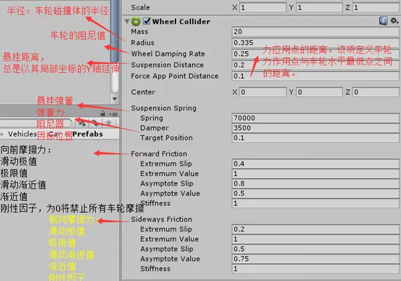
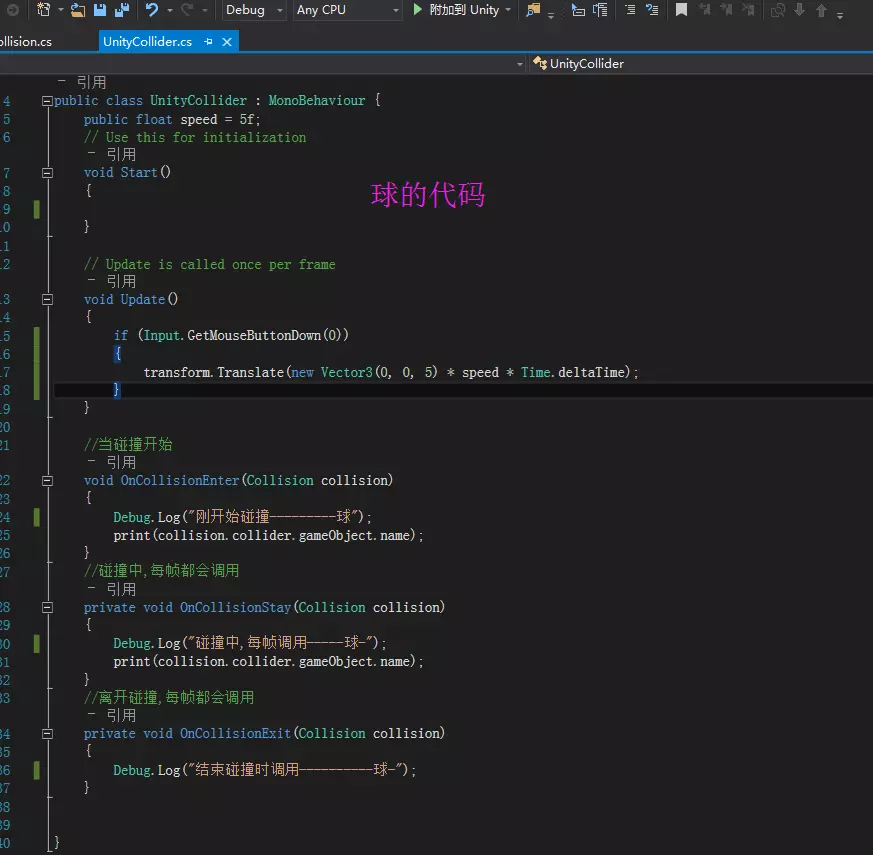
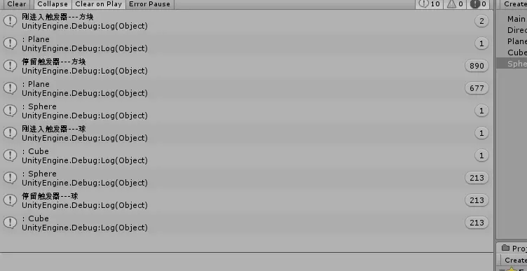

### 什么是碰撞器？

描述了物体可被碰撞的边界，以及碰撞过程中相互影响效果。
 碰撞效果：
 两个游戏对象碰在一起，通过物理引擎产生类似现实的效果

#### 碰撞器的种类：

1、盒碰撞器（Box Collider）
 2、椭圆碰撞器（Sphere Collider）
 3、胶囊碰撞器（Capsule Collider）
 4、车轮碰撞器（Wheel Collider）专用于车辆
 5、网格碰撞器（Mesh Collider）
 6、地形碰撞器（Terrain Collider）

1、盒碰撞器（Box Collider）
 盒子碰撞器是一个立方体外形的基本碰撞体，该碰撞体可以调整为不同大小的长方体，可以做门，墙等

 

2、椭圆碰撞器（Sphere Collider）

椭圆碰撞器是一个基本球形的基本碰撞体，球形碰撞体的三维大小可以均匀的调节，适用于落石，球形障碍物

3、胶囊碰撞器（Capsule Collider）
 是由一个圆柱体和与其相连的两个半球体组成

4、车轮碰撞器（Wheel Collider）
 是一种针对地面车辆的特殊碰撞体，有内置的碰撞检测、车轮物理系统及有滑胎摩擦的参考体。

5、网格碰撞器（Mesh Collider）
 通过获取网格对象并在其基础上构建碰撞碰撞。更加精细，但是会使用更多系统资源。开启Convex参数的网格碰撞体才可以与其他网格碰撞体发生碰撞

 

通常两个网格碰撞体之间不会发生碰撞，但是它们都可以与基本碰撞体发生碰撞如果要让它发生碰撞：开启Convex属性

#### 1.碰撞的方法

****球跟胶囊的代码****

球的代码

胶囊的代码

****情形一****
 当两个游戏对象拥有刚体和碰撞器,不管脚本挂哪个游戏对象都可以进入Oncollision，两者都挂在碰撞器脚本都会调用各自身脚本上的OnCollision方法。

 

****情形二****
 碰撞体球带有刚体，有碰撞器，有脚本，一开始就会进入自身的碰撞器方法打印与地面的接触。
 被碰撞物胶囊有碰撞器，有脚本，但是没有刚体，一开始不会进入自身的碰撞器方法。
 当两个物体发生碰撞，两者脚本中的碰撞器方法都会被触发打印

打印结果为：
 首先一开始发现只有有刚体的球打印了自己的碰撞器方法

当球碰到胶囊的时候两者都触发打印

一开始打印：

 

二者相碰，拥有刚体与碰撞器并且身上有碰撞器方法的小球遇到没有碰撞器的胶囊（不管有没有刚体都一样1）会直接穿过去。

****情形四****
 球与胶囊都只有碰撞器跟脚本，没有刚体

 

打印结果：
 当两者没有刚体而只有碰撞的时候，两者是不会发生碰撞的，互相穿过。
 因此二者都没有打印结果，是空的

#### 最终结论：

1、只要有刚体有碰撞器，并且与其他碰撞器碰撞就会进入自身的碰撞器方法2、没有刚体，有碰撞器的物体被一个拥有刚体的碰撞器碰撞，都会调用自身的碰撞器方法。3、没有刚体的两个碰撞器相撞不会调用任何碰撞器方法
 最终结论：
 碰撞器(Collider)不需要刚体(Rigidbody)
 刚体(Rigidbody)要发生碰撞，一定需要碰撞器(Collider)
 碰撞器决定了碰撞发生时的边界条件
 刚体决定了碰撞发生后的物体的运动效果
 没有碰撞器的刚体，会在物理模拟中相互穿透。

### 2、触发器的方法

****情形一****
 1、当两方带有触发器跟脚本，没有刚体的时候，二者不会打印触发器方法

 

2、其中一方是触发器，另一方是碰撞器，二者也不会打印触发器方法，都不会打印东西。

一样不会打印东西

****情形二****
 给球添加一个刚体，且是个触发器的时候，球会直接与地面产生交互，穿透地面，并打印触发方法。

打印触发方法：

****情形三****
 给球的刚体勾上Is kinematic

此时当球与方块碰撞的时候，当球与方块会打印各自的触发器方法。

 

****情形四****
 当球与方块都有刚体和触发器和脚本的时候，二者都会调用触发方法

打印结果：

****情形五****
 只要一方是触发器，另一方是有碰撞体就会触发各自的触发器方法

打印结果：

#### 结论：

1、想要打印触发器方法，必须有一方是触发器，必须有一方带有刚体。二者缺一不可。
 2、双方都是触发器，或者其中一方是触发器，另一方是碰撞器，都不会打印。
 3、只要一方是触发器，并且有刚体组件，不管另一方是碰撞体还是触发器都会打印各自的触发器方法。
 4、一般我们将触发器方法写在角色碰到的物体上，角色一般不参与触发方法。只写碰撞方法。

 

转至[Unity3D-Collider(碰撞器)与Tirgger(触发器)--详解](https://www.jianshu.com/p/f99463f0578d)

 

 

 

 