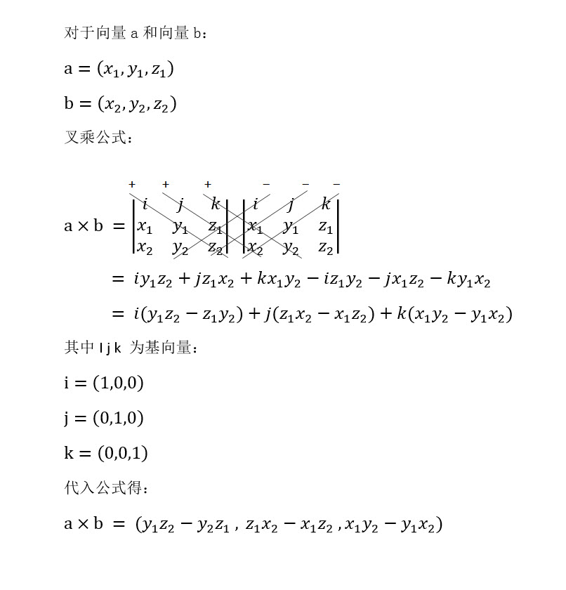

####1.常用静态变量值

| 变量 | 值 |
|--------|--------|
|back | Vector3(0, 0, -1)|
|forward | Vector3(0, 0, 1)|
|up | Vector3(0, 1, 0)|
|down | Vector3(0, -1, 0)|
|left | Vector3(1, 0, 0)|
|right | Vector3(-1, 0, 0)|
|one | Vector3(1, 1, 1)|
|zero | Vector3(0, 0, 0)|

####2.部分成员变量
magnitude(长度Read Only)
normalized(该向量的归一化向量Read Only)
sqrMagnitude(长度的平方Read Only)
**this[int]**([0], [1], [2]索引访问x,y,z)

####3.部分方法
**Set**(重设ｘ,y,z值)

####4.静态方法
**Angle**:返回from到to二者之间的夹角(0~180)；
**ClampMagnitude(Vecttor3 v, float maxLength)**:返回v的copy，当模超出maxLength时，该向量方向不变，模限制在maxLength。
**Cross**:左手法则叉乘。(rightxup=forword, upxright=back)

向量叉乘附加知识：

向量叉乘几何意义：
在三维几何中，向量a和向量b的叉乘结果是一个向量，该向量垂直于a和b向量构成的平面，该向量也被称作法向量
向量叉积的和：
将叉乘的到的向量每个分量相加，得到叉积和
a x b = y1\*z2- y2\*z1 + z1\*x2 - x1\*z2+ x1\*y2 - y1\*x2

```
向量叉积和的应用：
1.判断两个向量之间的顺逆关系
若 P x Q > 0，则P在Q的顺时针方向
若 P x Q < 0，则P在Q的逆时针方向
若 P x Q = 0，则P和Q共线

2.判断凸多边形
以多边形相邻两条边为向量进行叉积和，如果全部大于零则是凸多边形，如果全部为零则共线，否则就是凹多边形

3.判断点和直线的位置关系
在线上选两个点和需要判断的点构成向量叉积和

4.判断点在矩形内部
```

**Dot**:点积
