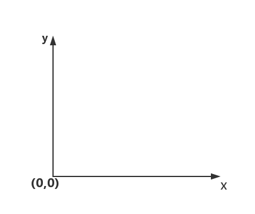

#### Input.mousePosition

当前鼠标的像素坐标位置；以左下角为(0,0)位置，右上角屏幕或窗口的像素坐标为(**Screen.width**, **Screen.heigh**)




#### Camera.ScreenToWordPoint

屏幕坐标转换为世界坐标，z的位置是以世界单位衡量的到相机的距离(屏幕坐标z)。 

```
摄像机渲染物体：
摄像机对游戏世界的渲染范围是一个平截头体，渲染边界是一个矩形，用与near clippingplane或者far clippingplane平行的平面截取这个平截头体，可以获得无数个平行的矩形面，也就是我们看到的屏幕矩形。离摄像机越远，矩形越大，离摄像机越近，矩形越小。所以，同样大小的物体，随着离摄像机越来越远，相对于对应屏幕矩形就越来越小，所看起来就越来越小。

在屏幕上，某个像素点相对于屏幕矩形的位置，可以对应于游戏世界中的点相对于某个截面的位置，关键在于这个点在哪个截面上，也就是说，关键在于这个截面离摄像机有多远！

在ScreenToWorldPoint这个方法中，参数是一个三维坐标，而实际上，屏幕坐标只能是二维坐标。参数中的z坐标的作用就是：用来表示上述平面离摄像机的距离。

也就是说，给定一个坐标（X，Y，Z），

首先截取一个垂直于摄像机Z轴的，距离为Z的平面P，这样不管X，Y怎么变化，返回的点都只能在这个平面上；

然后，X，Y表示像素坐标，根据（X，Y）相对于屏幕的位置，得到游戏世界中的点相对于截面P的位置，我们也就将屏幕坐标转换为了世界坐标。
```


#### Camera.WorldToScreenPoint

从世界空间到屏幕空间变换位置, z的位置是以世界单位衡量的到相机的距离(屏幕坐标z)。 


#### RectTransformUtility变换工具

RectTransformUnity是RectTranform的辅助类

##### 1.ScreenPointToWorldPointInRectangle(RectTransform rect, Vector2 screenPoint, Camera cam, out Vector3 worldPoint);

将屏幕空间上的点转换为位于给定RectTransform平面上的世界空间中的位置。cam参数应该是与屏幕点相关的相机。对于Canvas设置为“Screen Space - Overlay mode”模式的情况，cam参数应该为null。 


