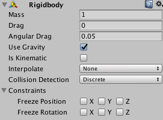

　　**Rigidibody**组件可为游戏对象赋予物理属性，为游戏开发者提供如在现实世界中物体受到力的作用的逼真效果（游戏引擎对其进行物理效果模拟）。

### １.使用注意事项

#### (1).父子关系

    	受物理系统控制，其刚体运动会随着游戏对象所属父对象的运动而运动，其依然受重力及碰撞影响下还会下落。

####　(2).动画

	在某些时候，主要是创建纸娃娃效果的时候，你可能需要在动画与物理控制之间进行切换。你可以将刚体设置为IsKinematic，当设置为Kinematic模式，它将不再受到外力影响。这时你只能通过变换方式来操作对象，但是Kinematic刚体还会影响其他刚体，但他自己不会再受物理引擎控制。比如，连在Kinematic刚体上的**Joints**（<font color=#0000ff>Joints 是个啥？</font>）还会继续影响连接的另一个非Kinematic刚体，同时也能够给其他刚体产生碰撞力。（<font color=#ff00ff>动力学刚体会影响其他的游戏对象，但自身不受到物理系统影响</font>）

#### (3).脚本

	脚本为游戏对象添加作用力和扭矩力，是通过刚体的**AddForce()**和**AddToraue()**方法。当使用物理引擎控制刚体时，不要直接操作对象的变换(Transform)数值。

#### (4).Colliders

	碰撞体是另一类必须添加的的组件，用来让对象能够发生碰撞。当两个刚体接触到一起的时候，除非两个刚体都设置了碰撞属性，否则物理引擎是不会计算他们的碰撞的。没有碰撞体的刚体在进行物理模拟的时候将会简单的穿过其他刚体。


### 2.刚体属性面板参数设置




| 选项                    | 详解                                                         |
| ----------------------- | ------------------------------------------------------------ |
| Mass                    | 质量                                                         |
| Drag                    | 空气阻力,用来阻碍物体移动；                                  |
| **Angular Drag**        | 角阻力，游戏对象**受到扭矩力**时受到空气阻力的大小。<br>用来阻碍物体旋转。 |
| Use Gravity             | 使用重力                                                     |
| **Is Kinematic**        | 开启动力学，开启有游戏对象只能通过<br>Transform组件对其控制，不再受到物理系统的影响 |
| **Interpolate**         | 控制刚体抖动情况:<br>None:无差值<br>Interpolate:内差值，基于上一帧Transform平滑此次Transform<br>Extrapolate:外差值，基于下一帧平滑此次Transform |
| **Collision Detection** | 用于避免高速运动对象无法与其他对象发生碰撞:<br>1.Discreate:离散碰撞检测，游戏对象与场景中其<br>   他所有碰撞体进行碰撞检测；<br>2.Continuous:连续碰撞检测，检测游戏对象与动<br>   态碰撞体的碰撞，<font color=#ff0000>使用连续碰撞检测模式来检测<br>   与网络碰撞体的碰撞；</font><br>3.Continuous Dynamic:连续动态碰撞检测。检测<br>连续碰撞模式或连续动态碰撞模式对象的检测<br> |
| Constraints             | 约束刚体运动：<br>Free Position(冻结x,y,z部分或全部位置)，<br>Free Rotation(冻结x,y,z部分或全部旋转) |

#### 注意点

	(1).两个刚体的相对质量决定他们在碰撞的时候将会如何反应。给刚体设置更大的质量并不会让它下降的更快，如果要实现这个目的，使用Drag参数。
	
	(2).低的阻力值使得对象看起来更重，高的阻力值使对象看起来更轻。典型的Drag值介于0.001(固体金属)到10(羽毛)之间。
	
	(3).如果你想同时使用变换和物理来控制对象，那么给他一个刚体组件并将其设置为Kinematic。
	
	(4).如果你通过变换来移动对象，同时又想收到对象的碰撞消息，那么必须给他一个刚体组件。


### 3.AddForce与ForceMode

通过Rigidibody的AddForce使游戏对象受力，产生运动；

```
(1)ForceMode.Acceleration模式
	持续向物体施加力，对物体的影响通过F=ma来影响加速度(忽略其他力)，该模式物体质量被视为1.
(2)ForceMode.Force模式
	同Accelerattion,但质量mass按实际来.
(3)ForceMode.Impulse模式
	对物体施加一个瞬间的力，冲量，f=mv。同时mass按实际计算.
(4).ForceMode.VelocityChange模式
	同Impulse,mass被视为1.
```


### 参考

[Collision Detection检测模式](https://blog.csdn.net/Ming991301630/article/details/77922493)  

[Collision Detection贴吧解释](http://tieba.baidu.com/p/2741418294)

[Unity Rigidbody详解](https://blog.csdn.net/f786587718/article/details/49105437)