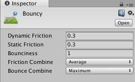
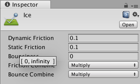
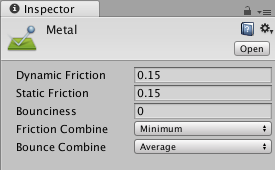
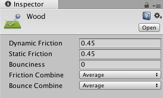
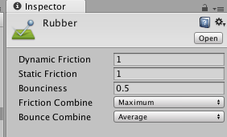
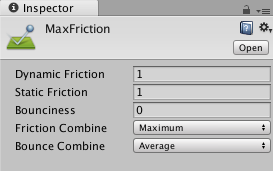
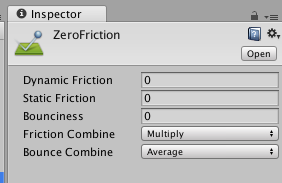

### 1.刚体与碰撞体

(1).碰撞体才能被射线检测到，否则无法被检测；

     碰撞体是产生碰撞的前提。

(2).需要模拟重力的自由下落，添加刚体；

     物体间发生碰撞时，主动体必须添加刚体。

### 2.物理材质Physic Material

物理材质用来调节碰撞物体的摩擦力和弹力效果。

| 属性             | 解释                                                         |
| ---------------- | ------------------------------------------------------------ |
| Dynamic Friction | 动态摩擦力，通常值在0~1之间；值为0的效果像冰， 而设为1时，物体运动将很快停止，除非有很大的外力或重力来推动它。 |
| Static Friction  | 静态摩擦力，当物体在表面静止的摩擦力，通常值在0到1之间; 当值为0时，效果像冰，当值为1时，使物体移动十分困难。 |
| Bounciness       | 表面的弹力（反弹系数）;0值将不反弹，1值反弹将没有任何能量损失。 |
| Friction Combine | 摩擦力组合方式： Average:两个摩擦力的均值； Minimum:使用两者之间最小的； Maximum:使用两者之间最大的； Multply:相乘。 |
| Bounce Combine   | 反弹组合方式：选项和Friction Combine一致。                   |

在中学物理中对摩擦力的定义是：当一个物体在另一个物体的表面上相对运动(或有相对运动的趋势)时，受到的阻碍相对运动(或阻碍相对运动趋势)的力，叫摩擦力，可分为静摩擦力和滑动摩擦力。

- 静摩擦力—— 有相对运动的趋势时发生作用；
- 滑动摩擦力 ——相对运动是发上作用。
- 静摩擦力<= 动摩擦力

##### Unity标准包中定义的几种物理材质(Standard Assets/PhysicsMaterials)

1.反弹球：

2.冰面：

3.金属:

4.木制：

5.橡胶材质：

6.MaxFriction:

7.ZeroFriction:

##### 注意：

添加物理材质，不论是使用反弹还是摩擦特性，都需要在两个接触的物体上都要添加Physic Material组件，要知道，力的作用是相互的。开发者往往在物体上添加了物理材质后，忘记在相接触的地板上也需要同样去添加物理组件，从而无法达到一个期望的效果。