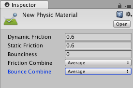

### 1.刚体与碰撞体

(1).碰撞体才能被射线检测到，否则无法被检测；

     碰撞体是产生碰撞的前提。

(2).需要模拟重力的自由下落，添加刚体；

     物体间发生碰撞时，主动体必须添加刚体。

### 2.物理材质Physic Material

物理材质用来调节碰撞物体的摩擦力和弹力效果。

| 属性             | 解释                                                         |
| ---------------- | ------------------------------------------------------------ |
| Dynamic Friction | 动态摩擦力，通常值在0~1之间；值为0的效果像冰， 而设为1时，物体运动将很快停止，除非有很大的外力或重力来推动它。 |
| Static Friction  | 静态摩擦力，当物体在表面静止的摩擦力，通常值在0到1之间; 当值为0时，效果像冰，当值为1时，使物体移动十分困难。 |
| Bounciness       | 表面的弹力（反弹系数）;0值将不反弹，1值反弹将没有任何能量损失。 |

